## System Architecture Description

**Overview**

This diagram illustrates a comprehensive web system architecture, primarily focused on efficiently handling file uploads (specifically images) and delivering them to users. It outlines the interactions between different software components and the underlying infrastructure. The architecture is logically divided into three layers: Client, Web, and Infrastructure.

```mermaid
graph TD
    subgraph Client [🧑‍💻 User Device]
        A[📱 Frontend React + Next.js + TS]
    end

    subgraph Web [🌐 Web System]
        A -->|Upload Multipart Image| B[Spring Boot 3.4+ API]
        B -->|PutObject| C[🪣 MinIO Server]
        A -->|Load Preview Image<br> Thumbnail URL| D[Nginx Static Proxy]
        D -->|Forward /files/*| C
    end

    subgraph Infra [🧱 Infrastructure]
        C -->|Persistent Storage| E[📁 Disk or S3-Compatible Storage]
    end

    style B fill:#ffedcc,stroke:#b36b00,stroke-width:2px
    style C fill:#ccf,stroke:#336,stroke-width:2px
    style D fill:#cfc,stroke:#393,stroke-width:2px
    style A fill:#d9f,stroke:#63f,stroke-width:2px
```

**Component Description**

1.  **Client Layer:**

    * **User Device (🧑‍💻):** This represents the user's interface, which could be a desktop, laptop, or mobile device.
    * **Frontend (📱 React + Next.js + TS):** This is the user-facing application, built using:
        * **React:** A JavaScript library for building dynamic user interfaces.
        * **Next.js:** A React framework that enables server-side rendering, routing, and other features for improved performance and SEO.
        * **TypeScript:** A superset of JavaScript that adds static typing, enhancing code maintainability and reducing potential runtime errors.
        * The Frontend handles user interactions, including uploading images and requesting to view them.

2.  **Web Layer:**

    * **Spring Boot 3.4+ API:** This is the backend application server, built using Java and the Spring Boot framework.
        * It receives image upload requests from the Frontend (as "Multipart Image" data).
        * It processes these requests, including handling file storage.
        * Spring Boot provides a robust and scalable platform for building web applications.
    * **MinIO Server (🪣):** MinIO is an open-source object storage server.
        * The Spring Boot API interacts with MinIO to store uploaded image files using the `PutObject` operation.
        * MinIO is designed to be compatible with Amazon S3, making it a flexible storage solution.
    * **Nginx Static Proxy:** Nginx is a high-performance web server and reverse proxy.
        * It acts as an intermediary between the Frontend and MinIO for serving image files.
        * When the Frontend requests an image (e.g., to load a preview using a "Thumbnail URL"), the request is routed through Nginx.
        * Nginx then forwards the request to MinIO (specifically, any request to `/files/*`).
        * This setup can improve performance by offloading static file serving from the Spring Boot API and providing potential caching.

3.  **Infrastructure Layer:**

    * **Disk or S3-Compatible Storage (📁):** This represents the actual storage location where the image files are persisted.
        * MinIO stores the data here.
        * This can be either:
            * Direct-attached storage (disks) on the server.
            * A network-attached storage system.
            * A cloud-based object storage service that is compatible with the S3 API (like Amazon S3).

**Workflow**

1.  **Image Upload:**
    * The user uploads an image through the Frontend.
    * The Frontend sends the image data to the Spring Boot API as a multipart request.
    * The Spring Boot API receives the image and uses the MinIO client library to store the image in the MinIO Server.
    * MinIO saves the image to the configured persistent storage.

2.  **Image Retrieval:**
    * The Frontend requests an image (e.g., a thumbnail) from the server.
    * The request is routed through Nginx.
    * Nginx forwards the request to MinIO, based on the URL path (`/files/*`).
    * MinIO retrieves the image from the persistent storage.
    * MinIO sends the image data back to Nginx.
    * Nginx sends the image data to the Frontend.
    * The Frontend displays the image to the user.

**Key Features and Benefits**

* **Scalability:** The architecture is designed to handle a growing number of users and files. MinIO can scale horizontally, and Nginx can handle a high volume of requests.
* **Performance:** Nginx acts as a reverse proxy to efficiently serve static content, reducing the load on the Spring Boot API.
* **Flexibility:** The use of MinIO provides flexibility in terms of storage options (local disk or cloud storage).
* **Modularity:** The separation of concerns between the Frontend, backend API, and storage components makes the system easier to maintain and update.
* **Modern Technologies:** The use of React, Next.js, TypeScript, and Spring Boot indicates a modern and robust technology stack.

